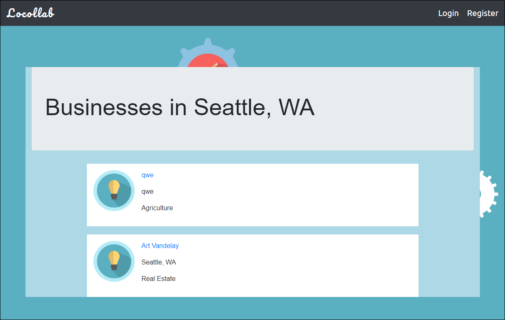

# LOCOLLAB
A social networking app for small local businesses

## Dependencies
###   

## Background
We realize a lot of small businesses are finding it a challenge to market their business and grow due to a variety of reasons- cost, lack of resources. So we decided to build our service that’s aimed at helping small business help each other. They could share costs of events, help build customer base, share bases and so on.

## Usage

Creating an account will allow you to view additional details of and search for a particular company that you would like to collaborate with. Information will include Business Name, Person Contact Name, Email, Address and Phone Number.

## Technologies and Techniques Used
* This project was bootstrapped with [Create React App](https://github.com/facebook/create-react-app).
* The following Node Packages were used in the creation of this particular Application.
    - **axios**
        - Promise based HTTP client for the browser and node.js
    - **bcrypt.js**
        - Password hashing package
    - **bootstrap**
        - Free collection of tools for creating a websites and web applications.
    - **cookie-parser**
        - Parse Cookie header and populate req.cookies with an object keyed by the cookie names.
    - **express**
        - Fast, unopinionated, minimalist web framework for node.
    - **heroku**
        - Heroku is a cloud platform that lets companies build, deliver, monitor and scale applications.
    - **if-env**
        - Simplify the running of different node environments in one script.
    - **mongoose**
        - MongoDB object modeling tool designed to work in an asynchronous environment.
    - **passport**
        - Passport is Express-compatible authentication middleware for Node.js.
    - **passport-local**
        - Local username and password authentication strategy for Passport.
    - **path**
        - Node.JS path module
    - **react-bootstrap**
        - Bootstrap 4 components built with React
    - **react-dom**
        - React package for working with the DOM.
    - **react-modal**
        - Accessible modal dialog component for React.JS
    - **react-router-dom**
        - DOM bindings for React Router
    - **validator**
        -   String validation and sanitization

## Development Notes
This Application runs on a Heroku Server utilizing MongoDB, Express, React & Node.

## Authors and Roles
- [John Laceda](https://github.com/jlaceda) (Backend)
- [Kevin LeRoy](https://github.com/jobu206) (Backend, Frontend & UI/UX)
- [Sophie Luehmann](https://github.com/sophieluehmann) (Backend & Frontend)
- [Vani Karikalan](https://github.com/vanikari) (PM, Backend & Frontend)

## Contributing
* Fork it (https://github.com/jlaceda/locollab/fork)
* Create your feature branch `git checkout -b feature/locollab`
* Commit your changes `git commit -am "Add your Message Here"`
* Push to the branch `git push origin feature/locollab`
* Create a new Pull Request (https://github.com/jlaceda/locollab/compare).

## Support
* Open a new issue [here](https://github.com/jlaceda/locollab/issues/new) for support.

## License
This project is licensed under the GNU GENERAL PUBLIC LICENSE - see the [LICENSE](LICENSE) for details.